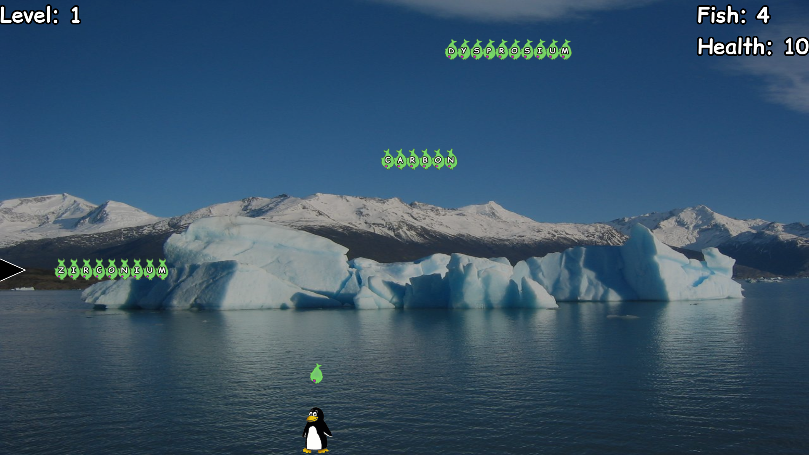
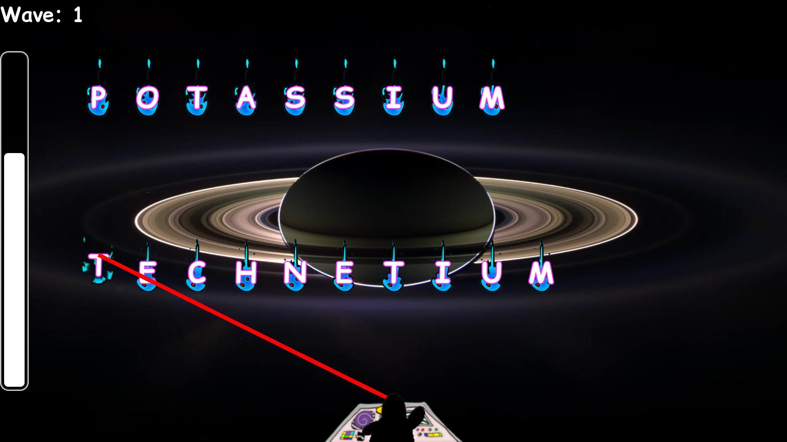
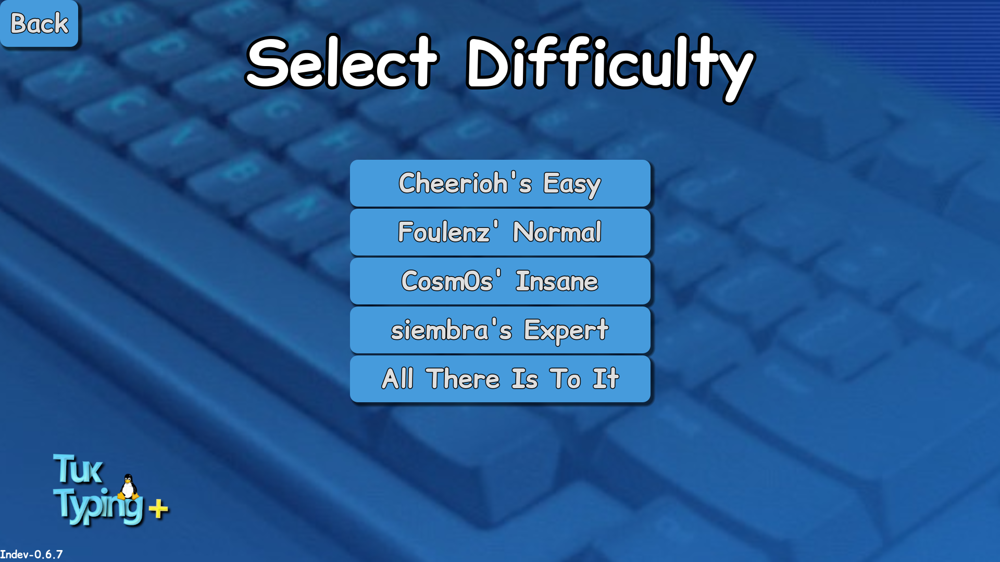
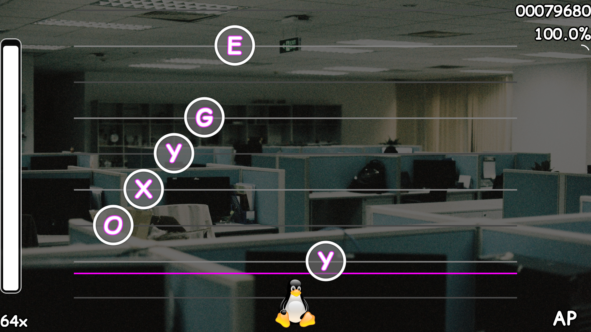
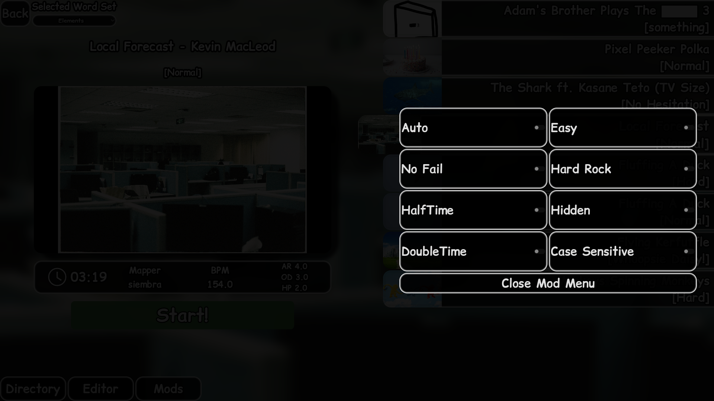
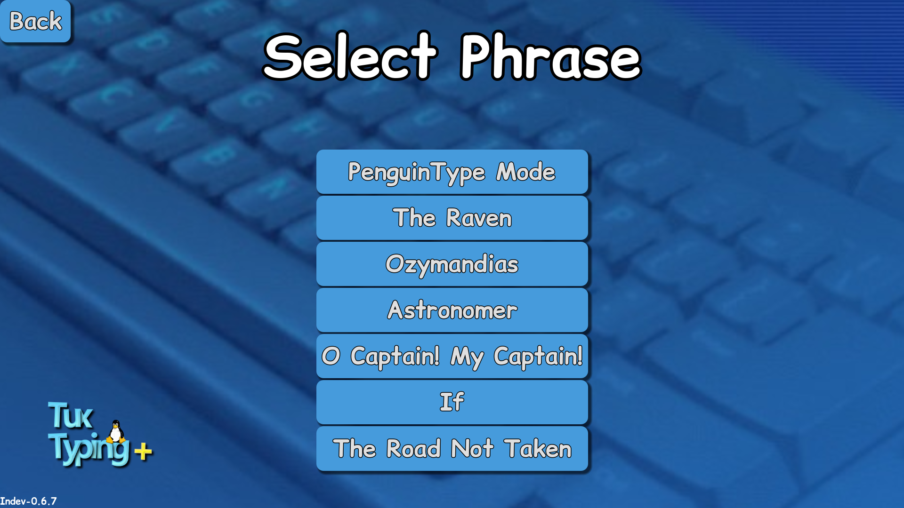
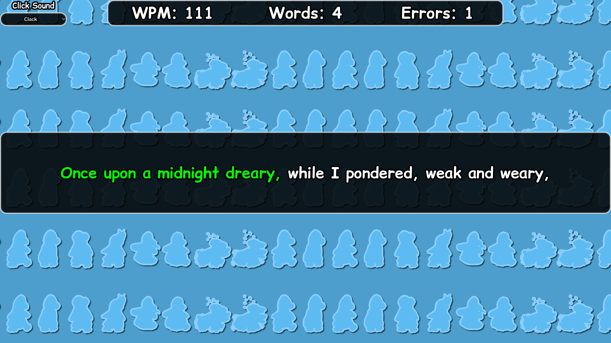

# Tux Typing+

A modern reimagining of the educational classic [Tux Typing](https://github.com/tux4kids/tuxtype) by [Tux4Kids](https://github.com/tux4kids), made in Godot by siembra & Cosm0s

## Current Version

### v1.0.3

## About Tux Typing+

One day my friend Cosm0s and I were bored and explored the GNOME Software Center on my Dell Latitude running Arch Linux.
We discovered Tux Typing and found it to be a fun concept, however it was limited severely by its aging codebase and infrastructure.
The game would not scale properly on modern display resolutions, and the repo had many files and folders that have not been updated
in nearly 2 decades. Even the README.md denoted the latest version having been from 2014, 12 years ago.

As such, Cosm0s and I decided to take it upon ourselves to not only remake the game for a new generation, but reimagine and
expand upon it beyond its original scope, and thus Tux Typing+ was born.

## Tech Stack

- [**Godot Engine**](https://github.com/godotengine/godot): We chose Godot for its free & open-source nature and its low barrier for entry. This allowed us to iterate quickly and learn a lot about software and game development without the shadow of a mega corporation looming over us.
- **That's All There Is To It**

## TuxEditor-0.2.11

This was easily the most time consuming part of the entire project. The entire charting and audio timing system for Proper Rhythm was built here
starting with TuxEditor-0.1.0, but we have iterated extensively here. 

### Core Features
- **Tap BPM**: Tap to the beat of the music and automatically generate the timeline!
- **Adjusting BPM & Offset**: Messed up with Tap BPM? No worries, you can also adjust them manually!
- **Background Images**: You can save background images along with your Proper Rhythm beatmaps! (PNG and JPG supported)
- **Background Videos (Experimental)**: You can also add background videos to your beatmaps, however due to Godot limitations, they must be in the .ogv format.
- **Tempo Changes**: Variable BPM song? No problem.
- **Preview Points**: Set where you want your beatmap to preview the song in the Proper Rhythm menu!
- **Shift Notes Left & Right**: Messed up your offset by a hair and don't want to manually replace every note? Shift them!
- **Fill Quavers**: Fill in every eight note immediately! Also shoutout to Quaver from UNBEATABLE.
- **Clear All Notes**: Start from scratch.
- **Difficulty Settings**: Adjust Approach Rate, Overall Difficulty, and HP Drain!
- **Discord Rich Presence**: Show your friends what you're charting! Or don't. Your call.
- **Import .osz Files**: Want more maps but don't want to chart em? Have access to nearly the entire osu! catalog of beatmaps!

### Regarding Background Videos
If you really want background videos in your map, it'll take a bit of effort.
We are considering options ranging from built-in OGV conversion to MP4 support via plugins, 
but as of right now the following procedure is to be followed.

#### Make sure FFmpeg is installed!
1. Navigate to your video's directory in a terminal

2. Rename your MP4 video to input.mp4

3. Convert MP4 to OGV with the following command
```bash
ffmpeg -i input.mp4 -c:v libtheora -q:v 7 -c:a libvorbis -q:a 5 output.ogv
```
4. Load the video into TuxEditor

5. Congratulations.

## Gamemodes

### Fish Cascade



Returning from the original Tux Typing is Fish Cascade.
Tux is hungry! Type to turn the words into fish and keep Tux fed! Do you have what it takes?
It remains faithful to the original, but with updated accessibility features and modern performance.

### Comet Zap



Oh no! A barrage of comets is coming! Help Tux defend the Earth by zapping away all the comets!
Also returning from the original!
Well, it's up to you to type as fast as you can!

#### Difficulties For Fish Cascade & Comet Zap



- **Cheerioh's Easy**
- **Foulenz' Normal**
- **Cosm0s' Insane**
- **siembra's Expert**
- **All There Is To It**

### Proper Rhythm

> NOTE: Due to web browsers being tricky to work with audio-wise, Proper Rhythm is disabled in the Web Version of the game! For the time being, at least.

Type the letters to the beat! Practice utilizing proper rhythm in your typing with this all-new rhythm game!

Completely brand new, and our biggest mode yet, is Proper Rhythm. Proper Rhythm is a fully-fledged osu!-inspired rhythm game built into Tux Typing+.
Proper Rhythm features an all-new modern UI, complete with an extensive Modifiers Menu, image previews, and music preview points.
The gameplay is derived from the aforementioned Comet Zap, where letters fall from the top, but instead in Proper Rhythm you must type the letters to the music!
Select from any given set of words, and type away! This gamemode can get very difficult, but it's great for practicing memorizing the location of the keys!



Proper Rhythm features several mod options to the gameplay, some making it easier and some more difficult!



- **Auto**: The map plays itself!
- **No Fail**: You can't game over with this one!
- **Half Time**: Play the map at .75x the speed!
- **Double Time**: Or, play the map at 1.5x the speed! (REALLY HARD)
- **Easy**: Halves Approach Rate, HP Drain, and Overall Difficulty.
- **Hard Rock**: Increases Approach Rate, HP Drain, and Overall Difficulty by 1.15x, and words spawn in reverse!
- **Hidden**: Notes fade out a bit before the hit line!
- **Case Sensitive**: Now words are capitalized and you must hit the Shift key for the first letter of every word. A nice challenge!

### Sandbox


Type to your heart's content. Just ignore the psychadelic background... or enable Minimize Effects in Accessiblity settings!

### Phrase Typing




Challenge your typing skills with the PenguinType word sets or a selection of poems filled with intricate patterns, capitalization, and symbols!

## Installation

It is recommended to download the official binaries from one of the following sources:

- [**GitHub**](https://github.com/siembra1978/tux-typing-plus/releases)
- [**itch.io**](https://cosm0s-spark.itch.io/tux-typing-plus)
- [**siembra.lol**](https://www.siembra.lol/games/tuxtypingplus/downloads)
- [**Flathub**](https://flathub.org/en/apps/lol.siembra.tuxtypeplus)

Alternatively, you can play the [Web Version](https://siembra.lol/games/tuxtypingplus/play/tuxtypeplus-linux-1.0.2.html)

OR, if you're just like that, you can build it straight from source!

## Build From Source

### Prerequisites

- Godot 4.6 or Higher
- Computer running Windows, macOS, or Linux
- Git for version control

1. Clone the repository:
```bash
git clone https://github.com/siembra1978/tux-typing-plus
cd tux-typing-plus
```
2. Open Godot 4.6.X

3. Load the project into Godot

4. Have fun!

Contributions that fit within the vision of the project are welcome, but we may be slow to address pull requests.

## Credits & Attributions

### A project by siembra & Cosm0s, licensed under the [GNU General Public License Version 2](LICENSE)

### Tux the Penguin
The Linux mascot, Tux, was created by [Larry Ewing](lewing@isc.tamu.edu) using The GIMP.

### The Original

[Tux Typing](https://github.com/tux4kids/tuxtype) by [Tux4Kids](https://github.com/tux4kids)
